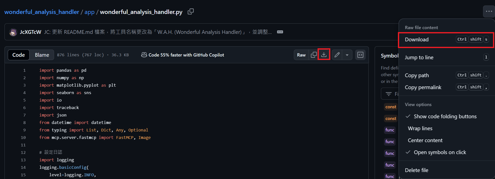

# W.A.H. (Wonderful Analysis Handler) 使用說明

## 工具功能

本工具集提供以下主要功能：

### 1. 資料分析

*   **功能**: 支援過濾、分組、聚合等操作，可以對 **CSV 格式**的資料進行基本分析。
    *   **如何請 Claude 使用**: 只要告訴 Claude 「使用W.A.H.幫我分析 `example/path.csv` 的年齡分佈」就可以了！

### 2. 資料視覺化

*   **功能**: 支援多種圖表類型，例如折線圖、柱狀圖、散點圖、圓餅圖、箱線圖和熱圖，可以將資料視覺化呈現。
    *   **如何請 Claude 使用**: 只要告訴 Claude 「使用W.A.H.幫我將 **CSV 格式**的 `example/data.csv`，繪製成柱狀圖，顯示每月銷售額」就可以了！

### 3. 進階統計分析

*   **功能**: 支援相關性分析、時間序列分析、分佈分析和假設檢定等進階統計分析。
    *   **如何請 Claude 使用**: 只要告訴 Claude 「使用W.A.H.幫我分析 **CSV 格式**的 `example/data.csv` 的相關性」就可以了！

## 在 Claude 中安裝 MCP 伺服器

本文件說明如何在 Claude 桌面應用程式中安裝和設定您的 MCP 伺服器。

## 取得程式碼

您可以選擇以下兩種方式取得程式碼：

### 1. 從 Git 複製儲存庫（推薦給開發者）

如果您是開發者，想要修改程式碼、貢獻功能或隨時取得最新更新，強烈建議從 Git 複製儲存庫：

1.  開啟終端機或命令提示字元。
2.  執行以下指令：

    ```bash
    git clone https://github.com/JcXGTcW/wonderful_analysis_handler
    cd wonderful_analysis_handler
    ```

### 2. 只下載 wonderful_analysis_handler.py 檔案（推薦給一般使用者）

如果您是一般使用者，只需要執行伺服器，且不關心程式碼更新，可以只下載 [wonderful_analysis_handler.py](https://github.com/JcXGTcW/wonderful_analysis_handler/blob/master/app/wonderful_analysis_handler.py) 檔案。
這種方式更簡單快速。




## 前提條件

*   已安裝 Claude 桌面應用程式
*   已安裝 `uv`

## 安裝 `uv`

`uv` 是一個快速的 Python 套件管理工具。請依照以下步驟安裝 `uv`：

### macOS

1.  開啟終端機。
2.  執行以下指令來安裝 `uv`：

    ```bash
    brew install uv
    ```

### Windows

1.  開啟 PowerShell。
2.  執行以下指令來安裝 `uv`：

    ```powershell
    pip install uv
    ```

3.  **重要**：在 Windows 上，請確認 `uv` 已加入到您的 `PATH` 環境變數。

## 設定 Claude 桌面應用程式

1.  找到 Claude 桌面應用程式的設定檔 `claude_desktop_config.json`。
    
    ▸ **快速開啟方式**：選單列點選 `Claude(Mac) 或 File(Windows)` ➔ `Settings` ➔ `Developer` ➔ `Edit Config`
2.  編輯 `claude_desktop_config.json` 檔案，加入您的 MCP 伺服器設定。
    *   以下是一個範例設定，請將範例中的路徑修改為您的檔案路徑：

        ```json
        {
          "mcpServers": {
            "W.A.H.": {
              "command": "uv",
              "args": [
                "run",
                "--with",
                "mcp[cli]",
                "--with",
                "pandas",
                "--with",
                "numpy",
                "--with",
                "matplotlib",
                "--with",
                "seaborn",
                "--with",
                "scipy",
                "/Users/jcxgtcw/Documents/GitHub/wonderful_analysis_handler/app/wonderful_analysis_handler.py"
              ]
            }
          }
        }
        ```

    *   **重要**：
        - **替換路徑指引**：
             
             請將範例路徑中的：
             ```json
             "/Users/jcxgtcw/Documents/GitHub/wonderful_analysis_handler/app/wonderful_analysis_handler.py"
             ```
             替換為您的實際路徑

        - **取得檔案路徑的方法**：
          **Mac**  
          ▸ 在 Finder 中找到檔案  
          ▸ 按住 <kbd>Option</kbd> 鍵 + 右鍵點擊  
          ▸ 選擇「複製 "檔案名" 為路徑名稱」  
          
          **Windows**  
          ▸ 在檔案總管選取檔案  
          ▸ 右鍵點擊  
          ▸ 選擇「複製為路徑」  
3.  儲存 `claude_desktop_config.json` 檔案。

## 執行 MCP 伺服器

1.  重新啟動 Claude 桌面應用程式。
2.  在 Claude 中，您應該可以看到您設定的 MCP 伺服器（例如 "資料分析工具"）。
3.  現在您可以開始使用您的 MCP 伺服器了！

> ⚠️ 首次安裝如遇到 MCP 伺服器無法啟動問題，請查看[疑難排解 ➔ 首次安裝](#疑難排解)

## 疑難排解

*   **首次安裝**：
    *   首次使用W.A.H.時，可能會因為uv正在背景安裝套件，導致Claude認為MCP逾時。安裝完套件後重新啟動Claude即可使用。

*   **找不到 `uv` 指令**：
    *   請確認您已正確安裝 `uv`，並將其加入您的 `PATH` 環境變數。
    *   **macOS**: 如果您使用 `brew` 安裝 `uv`，通常不需要完整路徑。但如果 Claude 還是找不到 `uv` 指令，可以試試看：
        1.  在終端機輸入 `which uv`，找到 `uv` 的完整路徑（例如：`/Users/.local/bin/uv`）。
        2.  編輯 `claude_desktop_config.json` 檔案，將 `"command": "uv"` 改為 `"command": "/Users/.local/bin/uv"` (替換成您找到的完整路徑)。
*   **無法啟動 MCP 伺服器**：
    *   請檢查 `claude_desktop_config.json` 檔案中的路徑是否正確。
    *   請確認您的 `wonderful_analysis_handler.py` 檔案沒有錯誤。
    *   如果您只下載了 `wonderful_analysis_handler.py` 檔案，請確認您已在 `claude_desktop_config.json` 檔案中使用 `--with` 參數指定所有相依套件。
    *   請查看 Claude 桌面應用程式的日誌，以獲取更多錯誤訊息。

如果您遇到任何問題，請參考 [MCP 文件](https://modelcontextprotocol.io/) 或聯絡技術支援。